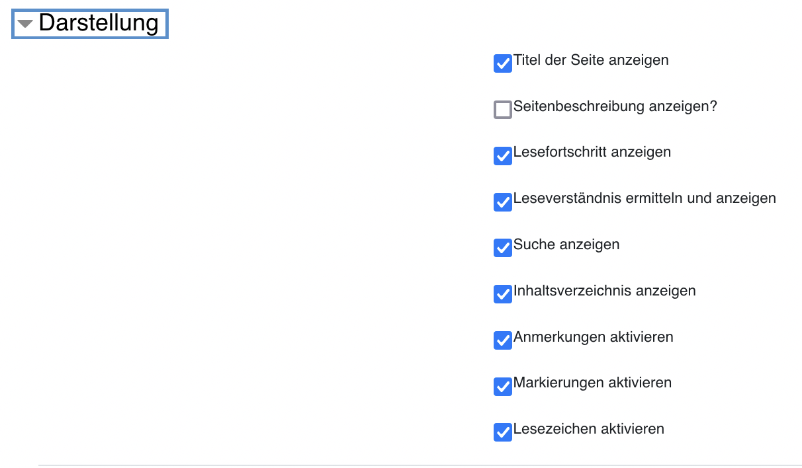

<!-- TODO:
- upload to zenodo
- link to the tex2html converter and mention footnotes
- provide example HTML structures for footnotes, references, images, tables, and headlines in separate document
- set tag 'latest'
- done: make animation `ffmpeg -ss 00:00:12.000 -i longpage.mov -pix_fmt rgb24 -r 10 -s 720x480 -t 00:02:38.000 longpage.gif`
-->


<br>
<div align="center">


</div>

<br>
<h1 align="center">Longpage</h1>

## *Longpage* is a Moodle activity plugin for reading long texts in online courses paired up with reading friendly design, text annotation, reading comprehension tests, reading progress analytics, and co-reading with other students.


*Longpage* (mod_longpage) is based on the [mod_page](https://docs.moodle.org/310/en/Page_resource) plugin which is part of the standard installation of Moodle. *Page* by itself simply allows for providing texts included in a Moodle page with no further functionality attached. *Longpage* can be seen as a replacement of *Page* providing users with advanced reading support. It enables teachers to provide realy long HTML textbooks. Teachers can also implement reading-related tasks such as marking text passages, checking reading comprehension, and group discussion.

<!-- development-related badges -->
[](https://github.com/CATALPAresearch/mod_longpage/commit-activity)
[](https://github.com/CATALPAresearch/mod_longpage/commit/)
[](https://github.com/CATALPAresearch/mod_longpage/contributors/)
[](https://github.com/CATALPAresearch/mod_longpage/issues/)
[](http://perso.crans.org/besson/LICENSE.html)


<!-- Maturity-related badges 
see: https://github.com/mkenney/software-guides/blob/master/STABILITY-BADGES.md
-->
[](https://github.com/mkenney/software-guides/blob/master/STABILITY-BADGES.md#mature)


<!-- AI-related and LA-related badges -->
<!-- 
https://nutrition-facts.ai/

Privacy Ladder Level
Feature is Optional
Model type
Base model
Base Model Trained with Customer Data
Customer Data is Shared with Model Vendor
Training Data Anonymized
Data Deletion
Human in the Loop
Data Retention
Compliance
-->


<br><br>
<p align="center" hidden>
  
</p>

<p align="center">
  <a href="#key-features">Key Features</a> •
  <a href="#how-to-use">How To Use</a> •
  <a href="#download">Download</a> •
  <a href="#credits">Credits</a> •
  <a href="#related">Related</a> •
  <a href="#citation">Citation</a> •
  <a href="#license">License</a>
</p>


## Key Features

The main features *Longpage* adds on top of *Page* are:

**Foster reading of longer text:**
* reading-friendly design
* renders any HTML including images, videos, tables, and mathematical formulas (expressed in [TeX notation](https://docs.moodle.org/310/en/Using_TeX_Notation)).
* automatic creation of interactive table of contents showing current reading position and allowing users to jump among sections of the text provided
* full-text search
* saves the last scroll position
* approximates reading time per section and the overall document
* visualises reading progress indicating how often a paragraph has been read

**Support elaboration of text:**
* highlight text in four different colors and underline text in red or black
* set a bookmark for a selection of text to remember that selection and jump back to it
* add personal notes 

**Enabling co-reading:**
* share notes among users publicly and anonymously,
* thread-based discussions from notes shared and contribute to them, e.g., answer a question by another user,
* subscribe to notifications regarding changes in threads, especially new posts/notes by other users,
* bookmark notes,
* like notes,
* determination if post has been read by user and ability to mark notes as read or unread,
* filter threads and posts by a set of filters regarding content, author, number of likes, status (read, liked, subscribed to, bookmarked), time created or last modified,
* sort threads by time last modified or created, position of anchor in text, relevance based on novelty, [collaborative filtering](https://en.wikipedia.org/wiki/Collaborative_filtering) and reading progress of user.

**Learning Analytics included**
* collection of clickstream data as well as text highlighting, bookmarks, notes, discussions, and search terms 
* capturing reading activities using the [Intersection Oversever](https://developer.mozilla.org/en-US/docs/Web/API/Intersection_Observer_API) to detect text elements visible on screen
* visualisation of reading progress as a vertical bar right next to a paragraph

## Roadmap and Limitations
**Roadmap**
* export to document to PDF including comments and highlighted text
* andvanced reading comprehension support

**Limitations**
- *Longpage* supports HTML instead of PDF

## How To Use

To clone and run this application, you'll need [Git](https://git-scm.com) and [Node.js](https://nodejs.org/en/download/) (which comes with [npm](http://npmjs.com)) installed on your computer. From your command line:

```bash
# Clone this repository
1. Clone  the repository to /your-moodle/mod/
$ git clone git@github.com:catalparesearch/mod_longpage.git

# Rename the folder to 'longpage'
$ mv mod_longpage longpage

# Go into the repository
$ cd longpage

# Install dependencies
$ cd vue
$ npm install

# Build the plugin by transpiling the vue code into javascript
$ npm run build

# Open the page https://<moodle>/admin/index.php?cache=1 and follow the install instructions for the plugin or
$ php admin/cli/uninstall_plugins.php --plugins=mod_longpage --run

# To install the *Longpage* plugin afterwards, copy the repository downloaded in the 1. step into the `mod` folder in the folder your Moodle installation is located in replacing the current `mod/longpage` folder containing the regular *Page* plugin. Now, login to your Moodle running as an administrator. The install/update GUI should open automatically. Just follow the steps the GUI presents to you and you should have installed the *Longpage* plugin successfully afterwards. As an alternative to using the GUI for installation, you can also run the update script from within the folder of your Moodle installation:
$ php admin/cli/upgrade.php

# Open a Moodle course of you choice and add longpage as an activity to your course.

```

Before you can install the plugin you should have a proper Moodle installation running. See [here](https://docs.moodle.org/310/en/Installing_Moodle) for a tutorial on how to install Moodle. Pay special attention to enabling [Cron](https://docs.moodle.org/310/en/Cron) since it is necessary for some functionality of the *Longpage* plugin (notifications on activity of other users, calculation of relevance of annotations/threads/posts for a user). The plugin has been developed with Moodle version 3.11 but it has also been tested with other version between 3.5 and 3.11 so it should work with them as well. We cannot make any statements about other versions since we have not tested it. Just give it a try ;) 


**Troubleshooting**

* disable caching in Moodle's config.php (`cachejs=false;`)
* remove, install or reinstall node_modules (npm install)
* moodle: purge caches and disable caching (use search: 'cache' on moodle site administration)
* If there is a javascript error that app-lazy.js could not be loaded, try to create a symbolic link from app-lazy.min.js to app-lazy.js. For Windows users:
`
mklink mod\longpage\amd\src\app-lazy.min.js mod\longpage\amd\build\app-lazy.min.js
`
* In case of an error like "ERR_OSSL_EVP_UNSUPPORTED" run `export NODE_OPTIONS=--openssl-legacy-provider`
* Compile errors like broken strings may be caused by wrong version of node.js. Install node v18 (check version `node --version`) and rerun `$ npm run build`.

**Plugin Settings**

See the settings page of the plugin. In the section "presentation" you'll find settings to enable and disable individual feeatures of the plugin.


**Embedding Reading Comprehension Questions**
In order to use embedded reading comprehension questions, you will need to install the ["Embed questions filter"](https://moodle.org/plugins/filter_embedquestion), ["Embed question atto button"](https://moodle.org/plugins/atto_embedquestion) and ["Embedded questions progress"](https://moodle.org/plugins/report_embedquestion) Moodle plugins. Documentation on how to embed questions with the plugin can be found [here](https://github.com/moodleou/moodle-filter_embedquestion/blob/main/internaldoc/functionality.txt).

Basically, with these plugins, you have to add a cryptic code for each question at the location in the text in the *Longpage* content where the question should appear in the sidebar when scrolling over the text.

You will also need to enable the reading comprehension feature in the plugin settings.

## Download

You can [download](https://github.com/catalparesearch/mod_longpage/releases/tag/latest) the latest installable version of *Longpage* for Moodle 3.11.

## Getting into Development
See our [getting started manual](readme_getting_started.md).


## Emailware

*Longpage* is an [emailware](https://en.wiktionary.org/wiki/emailware). Meaning, if you liked using this plugin or it has helped you in any way, I'd like you send me an email at <niels.seidel@fernuni-hagen.de> about anything you'd want to say about this software. I'd really appreciate it!

## Credits

This software uses the following open source packages:
[vue.js](https://vuejs.org/), 
[vuex](https://vuex.vuejs.org/), 
[vue-router](https://router.vuejs.org/), 
[node.js](https://nodejs.org/).

## Related

* [mod_page](https://github.com/moodle/moodle/tree/master/mod/page) - Moodle core plugin
* [mod_pdfannotator](https://moodle.org/plugins/mod_pdfannotator) - Moodle plugin for presenting and annotating PDF files.

## Citation

**Cite this software:**

Seidel, N., Stritzinger, A., Menze, D., & Friedrich, K. (2024). Longpage - A Moodle activity plugin designed to assist learners with reading extended texts. https://doi.org/10.17605/OSF.IO/VBCTW

> @misc{Seidel2024-MoodleLongpage,
author = {Seidel, Niels and Stritzinger, Adrian and Menze, Dennis and Friedrich, Konstantin},
doi = {10.17605/OSF.IO/VBCTW},
keywords = {P-APLE-II,open data,software},
title = {{Longpage - A Moodle activity plugin designed to assist learners with reading extended texts.}},
url = {https://github.com/CATALPAresearch/mod{\_}longpage},
year = {2024}
}


**Research articles and datasets about Longpage:**

* Menze, D., Seidel, N., & Kasakowskij, R. (2022). Interaction of reading and assessment behavior. In P. A. Henning, M. Striewe, & M. Wölfel (Eds.), DELFI 2022 – Die 21. Fachtagung Bildungstechnologien der Gesellschaft für Informatik e.V. (pp. 27–38). Gesellschaft für Informatik. https://doi.org/10.18420/delfi2022-011
* Seidel, N., & Menze, D. (2022). Interactions of reading and assessment activities. In S. Sosnovsky, P. Brusilovsky, & A. Lan (Eds.), 4th Workshop on Intelligent Textbooks, 2022 (pp. 64–76). CEUR-WS. http://ceur-ws.org/Vol-3192/
* Menze, D., & Seidel, N. (2022). Support for Reading Comprehension in Digital Course Texts. In M. Mandausch & P. A. Henning (Eds.), Proceedings of DELFI Workshops 2022 (pp. 105–116). https://doi.org/10.18420/delfi2022-ws-21
* Seidel, N., & Menze, D. (2022). Data and Analysis of Reading and Assessment Activities in Moodle. Zenodo. https://doi.org/10.5281/zenodo.7300070


## You may also like ...

* [format_serial3](https//github.com/catalparesearch/format_serial3) - Learning Analytics Dashboard for Moodle Courses
* [mod_usenet](https//github.com/catalparesearch/mod_usenet) - Usenet client for Moodle
* [local_ari](https//github.com/catalparesearch/local_ari) - Adaptation Rule Interface
* [mod_hypercast](https://github.com/nise/mod_hypercast) - Hyperaudio player for course texts supporting audio cues, text2speech conversion, text comments, and collaborative listining experiences 
* [tex2html]() - Convert LaTeX to HTML *Longpage* format

## License

[GNU GPL v3 or later](http://www.gnu.org/copyleft/gpl.html)


## Contributors
* Niels Seidel [@nise81](https://twitter.com/nise81)
* Adrian Stritzinger
* Dennis Menze
* Konstantin Friedrich

---
<a href="https://www.fernuni-hagen.de/english/research/clusters/catalpa/"></a>
<a href="https://www.fernuni-hagen.de/"></a>


