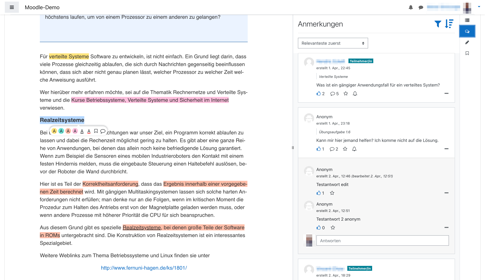

# mod-longpage



*Longpage* or *mod-longpage* is a [Moodle (Activity) plugin](https://docs.moodle.org/dev/Activity_modules)  for providing long and structured texts in HTML for courses paired up with functions to navigate, annotate and co-read the text with other users. It is based on the [Page](https://docs.moodle.org/310/en/Page_resource) or [mod_page module](https://docs.moodle.org/310/en/Page_resource) which is part of the standard installation of Moodle. *Page* by itself simply allows for providing texts included in a Moodle page with no further functionality attached. *Longpage* can be seen as an extension of *Page* with is to be used as a replacement of *Page* for providing users with extra functionality. The main features *Longpage* adds on top of *Page* are:
* reading-friendly design,
* automatic prediction and inclusion of time necessary for reading a chapter, section etc.,
* automatic saving of last scroll position to be able to continue reading at the position where the text was last left,
* automatic creation of interactive table of contents showing current reading position and allowing users to jump among sections of the text provided,
* ability to highlight text in four different colors and underline text in red or black,
* ability to set a bookmark for a selection of text to remember that selection and jump back to it,
* ability to add a note to a selection of text that can contain mathematical formulas expressed in [TeX notation](https://docs.moodle.org/310/en/Using_TeX_Notation),
* ability to share notes among users publicly and anonymously,
* ability to start thread-based discussions from notes shared and contribute to them, e.g., answer a question by another user,
* ability to subscribe to notifications regarding changes in threads, especially new posts/notes by other users,
* ability to bookmark notes,
* ability to like notes,
* automatic determination if post has been read by user and ability to mark notes as read or unread,
* ability to filter threads and posts by a set of filters regarding content, author, number of likes, status (read, liked, subscribed to, bookmarked), time created or last modified,
* ability to sort threads by time last modified or created, position of anchor in text, relevance based on novelty, [collaborative filtering](https://en.wikipedia.org/wiki/Collaborative_filtering) and reading progress of user.

## Installation
Before you can install the plugin you should have a proper Moodle installation running. See [here](https://docs.moodle.org/310/en/Installing_Moodle) for a tutorial on how to install Moodle. Pay special attention to enabling [Cron](https://docs.moodle.org/310/en/Cron) since it is necessary for some functionality of the Longpage plugin (notifications on activity of other users, calculation of relevance of annotations/threads/posts for a user). The plugin has been developed with Moodle version 3.9 since it represent the current LTS but it has also been tested with other version between 3.5 and 3.10 so it should work with them as well. We cannot make any statements about other versions since we have not tested it. Just give it a try ;) 

On installing the plugin itself:
1. Clone this repository and rename the folder to `page`.

The *Longpage* plugin just downloaded is going to replace the *Page* plugin probably already installed in your Moodle installation. Inside Moodle the *Longpage* plugin also goes under the name *Page* so don't wonder if you don't find the name *Longpage* mentioned anywhere except in the code. Since the *Longpage* plugin is currently lacking update scripts - feel free to add some ;) - but alters database tables already created by Moodle or, more specifically, the *Page* plugin, e.g. adding a column, you cannot simply replace the *Page* plugin by the *Longpage* plugin since tables would not be altered and you would end up in an inconsistent state unable to use the plugin. Instead you have to install the already installed *Page* plugin first and, then, do a fresh install of the *Longpage* plugin.

2. To uninstall the *Page* plugin probably already installed, go to the folder your Moodle installation is located in and run

```shell
php admin/cli/uninstall_plugins.php --plugins=mod_page --run
```

3. To install the *Longpage* plugin afterwards, copy the repository downloaded in the 1. step into the `mod` folder in the folder your Moodle installation is located in replacing the current `mod/longpage` folder containing the regular *Page* plugin. Now, login to your Moodle running as an administrator. The install/update GUI should open automatically. Just follow the steps the GUI presents to you and you should have installed the *Longpage* plugin successfully afterwards. As an alternative to using the GUI for installation, you can also run the update script from within the folder of your Moodle installation:

```shell
php admin/cli/upgrade.php
```

## Usage

You use the *Longpage* plugin exacly like as you would use the regular *Page* plugin since *Longapge* is simply the *Page* plugin with some functionality added on top. If you don't yet know how to use the *Page* plugin, have a look into the [official Moodle documentation](https://docs.moodle.org/310/en/Page_resource).

## Troubleshooting

* remove, install or reinstall node_modules (npm install)
* moodle: purge caches and disable caching (use search: 'cache' on moodle site administration)
* If there is a javascript error that app-lazy.js could not be loaded, try to create a symbolic link from app-lazy.min.js to app-lazy.js. For Windows users:
```shell
mklink mod\longpage\amd\src\app-lazy.min.js mod\longpage\amd\build\app-lazy.min.js
```

## Contributing

To contribute to the plugin you should study the [Moodle documentation on plugin development](https://docs.moodle.org/dev/Main_Page) deeply. The plugin is very similar to a regular [Activity plugin](https://docs.moodle.org/dev/Activity_modules). The main difference regards the client or asynchronous javascript modules (AMD) (`amd` directory). Instead of creating javascript files inside `amd` in [require.js](https://requirejs.org/) format from scratch, working with [Grunt](https://gruntjs.com/) etc., the main part of the client which is a [SPA](https://en.wikipedia.org/wiki/Single-page_application) for reading, annotating and navigating the text, is developed with [Vue.js v3](https://v3.vuejs.org/). The files are located inside the `vue` directory which is where you mainly develop the client like you would develop a regular SPA with Vue.js. Sadly, you do not have hot reload like you are maybe used to from other projects with Vue.js. Instead you run

```shell
npm run watch
```

inside the `vue` directory. From then on [Webpack](https://webpack.js.org/), the bundler used for this project, is going to watch all the files in `vue` and its direct and indirect subdirectories. Whenever a file changes, a new (developmental) version of `amd/app-lazy.min.js` which is the bundle that contains all html, css and javascript of the SPA. You then have to reload the page inside the browser if you are currently on it to view changes you made to the SPA. 

When deploying to production, you run 

```shell
npm run build
```

to let Webpack bundle up a production ready version of the plugin. IMPORTANT: Do not use `npm run watch` to build for production since it lacks some optimizations that Webpack applies, i.e. in order to make the bundle smaller in size.

## Licence
[GNU GPL v3 or later](http://www.gnu.org/copyleft/gpl.html)
